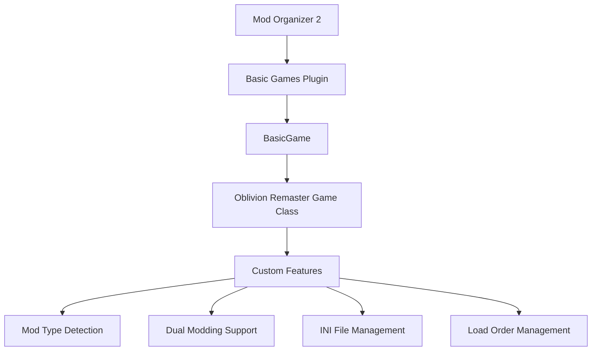

# System Patterns: MO2 Plugin for Oblivion Remaster

## System Architecture

The MO2 plugin for Oblivion Remaster will integrate with Mod Organizer 2's existing architecture using the Python-based basic_games framework. This approach was chosen for better portability, flexibility, and ease of development.

### Python Plugin Architecture (via basic_games)



In this architecture:
- The plugin is a Python class that inherits from `BasicGame`
- Game-specific properties are defined as class attributes
- Custom behavior is implemented by overriding methods
- Additional features are registered using the `_register_feature` method
- Custom components handle the dual modding systems (traditional Bethesda and UE5)

## Key Components

The plugin will consist of these key components:

### 1. Game Detection Component

Responsible for:
- Detecting the Oblivion Remaster installation at `[Steam Library]\steamapps\common\Oblivion Remastered`
- Identifying the game version
- Locating key game directories and files

Implementation:
```python
class OblivionRemasteredGame(BasicGame):
    GameName = "The Elder Scrolls IV: Oblivion Remastered"
    GameShortName = "oblivionremastered"
    GameSteamId = [STEAM_ID]  # Need to find the actual Steam ID
    GameBinary = "OblivionRemastered.exe"
    GameDataPath = "OblivionRemastered/Content"
```

### 2. Dual Mod Management Component

Responsible for:
- Defining the structure of mod directories for both traditional and UE5 mods
- Mapping mod files to the appropriate game directories via USVFS:
  - Traditional mods to `OblivionRemastered\Content\Dev\ObvData\Data`
  - UE5 mods to `OblivionRemastered\Content\Paks\~mods`
- Handling mod activation/deactivation for both mod types

Implementation:
```python
class OblivionRemasteredInstaller(BasicInstaller):
    def install(self, mod_name, tree, version, nexus_id):
        # Detect mod type and restructure accordingly
        if self._is_traditional_mod(tree):
            # Place files in Dev/ObvData/Data/
            return self._install_traditional_mod(mod_name, tree, version, nexus_id)
        else:
            # Place files in Paks/~mods/
            return self._install_ue5_mod(mod_name, tree, version, nexus_id)
```

### 3. Plugin Management Component

Responsible for:
- Managing .esp/.esm plugin files
- Handling load order via the `Plugins.txt` file
- Enforcing plugin dependencies and rules

Implementation:
```python
class OblivionRemasteredPluginManager(BasicGamePluginManager):
    def writePluginLists(self, pluginList):
        # Write to OblivionRemastered/Content/Dev/ObvData/Data/Plugins.txt
        plugins_path = os.path.join(
            self._organizer.managedGame().dataDirectory().absolutePath(),
            "Dev", "ObvData", "Data", "Plugins.txt"
        )
        with open(plugins_path, "w") as f:
            for plugin in pluginList:
                f.write(plugin + "\n")
```

### 4. Unreal Engine Asset Management Component

Responsible for:
- Handling .pak/.ucas/.utoc files and other Unreal Engine assets
- Managing alphabetical load order for UE5 mods
- Providing appropriate installation and management for UE assets

Implementation:
```python
class UE5ModManager:
    def getLoadOrder(self):
        # UE5 mods are loaded alphabetically
        return sorted(self._get_ue5_mods())
        
    def setLoadOrder(self, new_order):
        # Implement prefix system for controlling load order
        # since UE5 loads alphabetically
        pass
```

### 5. INI File Management Component

Responsible for:
- Managing game configuration files (.ini)
- Handling profile-specific INI settings
- Supporting INI tweaks

Implementation:
```python
class OblivionRemasteredGame(BasicGame):
    # Define the .ini files to manage
    GameIniFiles = ["Oblivion.ini", "Oblivion_default.ini", "BlendSettings.ini"]
    
    def documentsDirectory(self):
        return QDir(os.path.join(
            self.gameDirectory().absolutePath(),
            "OblivionRemastered", "Content", "Dev", "ObvData"
        ))
```

### 6. Save Game Management Component

Responsible for:
- Identifying and displaying save games
- Providing save game information
- Managing save game compatibility with mods

Implementation:
```python
class OblivionRemasteredSaveGame(BasicGameSaveGame):
    def allFiles(self):
        return [self._filepath.name]
        
class OblivionRemasteredGame(BasicGame):
    GameSaveExtension = "ess"  # Assuming same as original Oblivion
    
    def savesDirectory(self):
        return QDir(os.path.join(
            self.documentsDirectory().absolutePath(),
            "Saves"  # Actual path needs verification
        ))
```

## Key Technical Decisions

### 1. Python Implementation via basic_games

**Decision:**
Use the Python-based basic_games framework rather than a native C++ plugin.

**Rationale:**
- **Portability**: Python plugins are more portable across different systems.
- **Flexibility**: Easier to adapt to changes in the game or modding approach.
- **Development Speed**: Faster to develop and iterate on.
- **User Preference**: The user has expressed a preference for Python.

**Implementation Details:**
- Inherit from `BasicGame` class
- Define game-specific properties as class attributes
- Override methods for custom behavior
- Register custom features using `_register_feature`

### 2. Dual Modding System Approach

**Decision:**
Set the game data path to `OblivionRemastered/Content` and implement custom handling for both traditional and UE5 mods.

**Rationale:**
- Allows handling both mod types from a single virtual root
- Provides flexibility for mods that might contain both types of files
- Simplifies the overall architecture while still supporting the dual modding nature

**Implementation Details:**
- Detect mod type during installation based on file extensions and structure
- Place traditional mod files in `Dev/ObvData/Data/`
- Place UE5 mod files in `Paks/~mods/`
- Provide visual indicators in the UI to distinguish between mod types

### 3. Load Order Management

**Decision:**
Implement separate load order handling for traditional and UE5 mods.

**Rationale:**
- Traditional mods use the `Plugins.txt` file for load order
- UE5 mods are loaded alphabetically from the `~mods` folder
- Different approaches are needed for each type

**Implementation Details:**
- For traditional mods: Manage the `Plugins.txt` file
- For UE5 mods: Potentially implement a prefix system to control alphabetical loading
- Provide clear UI indicators for load order in both systems

### 4. INI File Management

**Decision:**
Implement support for managing game configuration files on a per-profile basis.

**Rationale:**
- Allows users to have different game settings for different mod setups
- Supports INI tweaks, a common modding approach
- Enhances the overall mod management experience

**Implementation Details:**
- Define relevant .ini files in `GameIniFiles`
- Set the documents directory to the appropriate location
- Implement custom handling for any UE5-specific configuration files if needed

## Critical Implementation Paths

1. **Game Detection and Basic Integration**
   - Implement game detection for Oblivion Remaster
   - Define basic game properties (name, paths, executables)
   - Integrate with MO2's core systems

2. **Dual Modding System Implementation**
   - Implement mod type detection
   - Set up virtual file system mapping for both mod types
   - Develop custom installer logic for proper file placement

3. **Traditional Bethesda Mod Support**
   - Implement .esp/.esm plugin management
   - Set up BSA handling
   - Configure `Plugins.txt` management
   - Implement load order handling

4. **Unreal Engine Asset Support**
   - Implement .pak/.ucas/.utoc file handling
   - Develop alphabetical load order management
   - Create UI indicators for UE5 mods

5. **INI File Management**
   - Identify and configure relevant .ini files
   - Set up profile-specific .ini handling
   - Support INI tweaks

6. **User Interface Enhancements**
   - Add mod type indicators
   - Implement filters for different mod types
   - Enhance conflict visualization for dual modding system

7. **Testing and Refinement**
   - Test with various mod configurations
   - Test with different combinations of traditional and UE5 mods
   - Optimize performance
   - Refine user interface and experience

## Implementation Example

Here's a simplified example of the core plugin implementation:

```python
class OblivionRemasteredGame(BasicGame):
    Name = "Oblivion Remastered Support Plugin"
    Author = "Your Name"
    Version = "1.0.0"
    
    GameName = "The Elder Scrolls IV: Oblivion Remastered"
    GameShortName = "oblivionremastered"
    GameNexusName = "oblivionremastered"
    GameNexusId = 7587
    GameSteamId = [STEAM_ID]  # Need to find the actual Steam ID
    
    GameBinary = "OblivionRemastered.exe"
    GameDataPath = "OblivionRemastered/Content"
    
    # INI files
    GameIniFiles = ["Oblivion.ini", "Oblivion_default.ini", "BlendSettings.ini"]
    
    def init(self, organizer):
        super().init(organizer)
        
        # Register custom features
        self._pluginManager = OblivionRemasteredPluginManager(organizer)
        self._register_feature(self._pluginManager)
        
        self._modInstaller = OblivionRemasteredInstaller()
        self._register_feature(self._modInstaller)
        
        self._saveGameInfo = OblivionRemasteredSaveGameInfo()
        self._register_feature(self._saveGameInfo)
        
        return True
    
    def documentsDirectory(self):
        return QDir(os.path.join(
            self.gameDirectory().absolutePath(),
            "OblivionRemastered", "Content", "Dev", "ObvData"
        ))
    
    def savesDirectory(self):
        return QDir(os.path.join(
            self.documentsDirectory().absolutePath(),
            "Saves"  # Actual path needs verification
        ))
```

This implementation provides the foundation for the plugin, with custom components handling the specific requirements of Oblivion Remaster's dual modding system.
