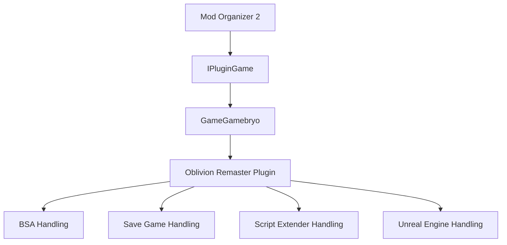
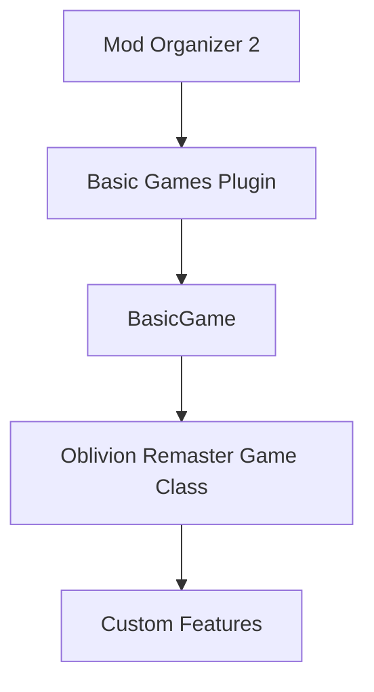

# System Patterns: MO2 Plugin for Oblivion Remaster

## System Architecture

The MO2 plugin for Oblivion Remaster will integrate with Mod Organizer 2's existing architecture, which follows a plugin-based design. There are two main approaches we can take:

### Option 1: Native C++ Plugin Architecture

In this architecture:
- The plugin inherits from `GameGamebryo`, which implements the `IPluginGame` interface
- The plugin overrides virtual methods to provide game-specific behavior
- Additional components handle specific aspects like BSA files, save games, etc.
- A new component would be needed for Unreal Engine-specific file handling

### Option 2: Python Plugin Architecture (via basic_games)

In this architecture:
- The plugin is a Python class that inherits from `BasicGame`
- Game-specific properties are defined as class attributes
- Custom behavior is implemented by overriding methods
- Additional features can be registered using the `_register_feature` method

## Key Components

Regardless of the architecture chosen, the plugin will need these key components:

### 1. Game Detection Component

Responsible for:
- Detecting the Oblivion Remaster installation
- Identifying the game version
- Locating key game directories and files

### 2. Mod Management Component

Responsible for:
- Defining the structure of mod directories
- Mapping mod files to the game directory via USVFS
- Handling mod activation/deactivation

### 3. Plugin Management Component

Responsible for:
- Managing .esp/.esm plugin files
- Handling load order
- Enforcing plugin dependencies and rules

### 4. Unreal Engine Asset Management Component

Responsible for:
- Handling .pak files and other Unreal Engine assets
- Managing conflicts between Unreal Engine mods
- Providing appropriate installation and management for UE assets

### 5. Save Game Management Component

Responsible for:
- Identifying and displaying save games
- Providing save game information
- Managing save game compatibility with mods

## Key Technical Decisions

### 1. Native C++ vs. Python Implementation

**Decision Points:**
- **Complexity**: If the plugin requires deep integration with MO2 or complex custom functionality, a native C++ plugin may be necessary.
- **Maintenance**: Python plugins are generally easier to maintain and update.
- **Performance**: C++ plugins may offer better performance for complex operations.
- **Development Speed**: Python plugins can be developed and iterated on more quickly.

**Current Direction:** 
Evaluate both approaches based on the specific requirements of Oblivion Remaster modding. If the modding approach is similar to existing Bethesda games with some additional UE features, the Python approach may be sufficient.

### 2. Handling Unreal Engine Assets

**Decision Points:**
- **Integration Method**: How to integrate UE asset management with MO2's existing systems.
- **Conflict Resolution**: How to detect and resolve conflicts between UE assets.
- **Installation Process**: How to handle the installation of UE mods, which may have different structures than traditional Bethesda mods.

**Current Direction:**
Research the structure and management of UE assets in Oblivion Remaster to determine the best approach. May require custom components regardless of whether C++ or Python is used.

### 3. Virtual File System Mapping

**Decision Points:**
- **Mapping Strategy**: How to map different types of mod files to the game directory.
- **Performance Considerations**: Ensuring efficient file access, especially for large mod collections.
- **Compatibility**: Ensuring compatibility with both traditional Bethesda mod files and UE assets.

**Current Direction:**
Leverage MO2's existing USVFS system, with potential extensions or customizations for UE assets if needed.

### 4. Plugin Load Order Management

**Decision Points:**
- **Load Order Mechanism**: How load order is determined and enforced.
- **Plugin Dependencies**: How to handle dependencies between plugins.
- **Conflict Resolution**: How to detect and resolve conflicts between plugins.

**Current Direction:**
Follow the established patterns from existing Bethesda game plugins, with adaptations for any Oblivion Remaster-specific requirements.

## Critical Implementation Paths

1. **Game Detection and Basic Integration**
   - Implement game detection
   - Define basic game properties
   - Integrate with MO2's core systems

2. **Traditional Bethesda Mod Support**
   - Implement .esp/.esm plugin management
   - Set up BSA handling if applicable
   - Configure save game handling

3. **Unreal Engine Asset Support**
   - Research UE asset structure in Oblivion Remaster
   - Implement .pak file handling
   - Develop conflict resolution for UE assets

4. **Testing and Refinement**
   - Test with various mod configurations
   - Optimize performance
   - Refine user interface and experience
